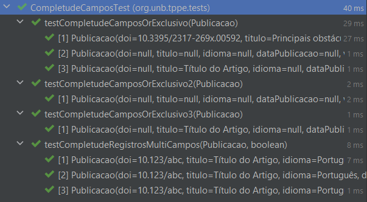

# Técnicas de Programação em Plataformas Emergentes - 2023.1

## Trabalho Prático 1 - Test-Driven Development

O objetivo deste trabalho é revisar os principais conceitos de TDD (*Test-Driven Development*) - 
testes parametrizados, testes de exceção, emprego de triangulação, duplicação e falsificação etc - com base
<a href="https://github.com/andrelanna/fga0242/tree/master/tp1" target="_blank">nesta</a> especificação.

## Observações

A leitura e o mapeamento do json presente no pacote ``org.unb.tppe.data`` são feitos na classe ``org.unb.tppe.model.repository.PublicacaoRepositoryImpl``. Ao executar, considerar
o sistema operacional no qual o projeto está sendo executado, visto que ele pode exigir outra forma de 
escrita do caminho.

Observar a versão do Java no ``pom.xml``.

## Resultados

## Estudantes

| Nome                     | Matrícula  |
|--------------------------|------------|
| Nícolas Georgeos Mantzos | 17/0051277 |
